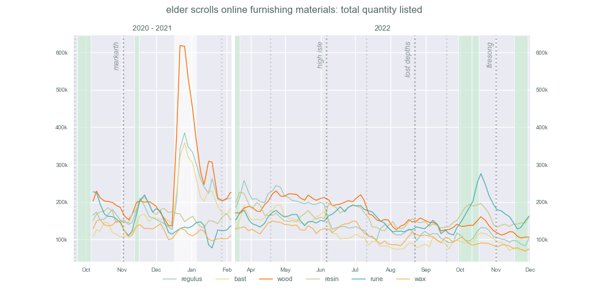

# Influence of new content on furnishing mat prices

Dotted vertical lines represent major patch release dates, with lighter lines for the public test server and darker lines for the live server. ESO doesn't release patch notes prior to the public test server, so that's the earliest date players know what furnishing plans will be added in the next update.

----------------------------------------

In the future I intend to add:

- a breakdown of new plan types per update
- examples of how many furnishings per category random players used in finished builds *(after Update 36: Firesong)*
- pre-Scalebreaker plans for mats per category pie charts

