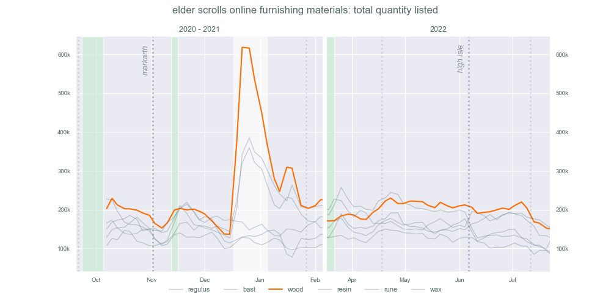

# __*The Elder Scrolls Online* Crafting Material Prices__

For my Code Kentucky Data Analysis 1 project I analyzed the price of furniture crafting materials in *The Elder Scrolls Online*. The materials are all used in similar ways with similar sources, but have had dramatically different price fluctuations since 2019.

## __Data__

Entries before March 2022 were obtained from the [Tamriel Trade Center](https://us.tamrieltradecentre.com/) add-on for ESO. Once Tamriel Trade Center's website added the price history for each item, most entries were recorded using the website rather than the add-on's in-game tooltip. Prices may be rounded differently depending on the source. TTC's suggested price ranges on each date were simplified by finding the mean of the in Google Sheets.

Due to an issue with TTC's website listing duplicates, the number of listings and total quantity listed for January 16th & 19th, 2021 were manually adjusted to be in line with other entries and the values for those dates aren't accurate.

#### __Uses:__

- python 3.10.4
- pandas 1.4.4
- numpy 1.21.5
- matplotlib 3.5.2
- seaborn 0.11.2

## __Project Plan__

#### __Feature 1: Read data in.__

Data is read using pandas read_csv function with a Google Sheets url.

#### __Feature 2: Manipulate and clean your data.__

- Used dropna to remove missing values
- Used filter to select specific columns from the csv
- Used pandas concat to combine results
- Renamed columns for readability

#### __Feature 3: Analyze your data.__

- Found the minimum value for each material in 2020-21 vs 2022.
- Found the date of the minimum value for each material in 2020-21 vs 2022.
- Found the maximum value for each material in 2020-21 vs 2022.
- Found the date of the maximum value for each material in 2020-21 vs 2022.
- Found the difference in price between each entry.
- Found the difference in quantity between each entry.

#### __Feature 4: Visualize your data.__

- Matplotlib line graph showing price in 2019, 2020-21, and 2022

- Matplotlib line graph of quantity in 2020-21 and 2022

- Matplotlib line graphs with shared x-axis and separate y-axis scales for comparing changes in price and quantity for heartwood, regulus, & bast in 2020-21 and 2022.

#### __Feature 5: Interpret your data and graphical output.__

The price of heartwood and mundane runes appears to increase in anticipation of upcoming content releases. The start of the New Life Festival also sharply increases the price of heartwood, bast, and regulus due to players listing at inflated prices (as price and quantity both spike at the same time).

### __Changes:__

- Replaced the original csv file with a Google Sheets link
- Added price & quantity charts at the bottom of the Jupyter notebook to show dates after original project with unique colors for each material
- Created functions for the change plots & event highlights

